# Infraestructura 2 – VPN IPsec Site-to-Site

### Merolyn Mejia
### Mat.2025-0827

## Video demostrativo

[Ver video demostrativo](COLOCAR_AQUI_EL_ENLACE_DEL_VIDEO)

---

## Índice

- [Propósito del laboratorio](#propósito-del-laboratorio)
- [Topología](#topología)
  - [Direccionamiento utilizado](#direccionamiento-utilizado)
- [Configuración de la infraestructura](#configuración-de-la-infraestructura)
  - [Red de Usuarios y DHCP](#red-de-usuarios-y-dhcp)
  - [NAT en Cisco](#nat-en-cisco)
  - [VPN IPsec Site-to-Site](#vpn-ipsec-site-to-site)
  - [Web Server HTTPS](#web-server-https)
  - [FortiGate](#fortigate)
- [Pruebas de funcionamiento](#pruebas-de-funcionamiento)
  - [Conectividad hacia Internet](#conectividad-hacia-internet)
  - [Comunicación Usuario → Web Server](#comunicación-usuario--web-server)
  - [Traceroute hacia el servidor](#traceroute-hacia-el-servidor)
  - [Prueba con el tráfico VPN bloqueado](#prueba-con-el-tráfico-vpn-bloqueado)
  - [Restauración de la comunicación](#restauración-de-la-comunicación)
- [Running Configuration](#running-configuration)
- [Conclusión](#conclusión)

---

## Propósito del laboratorio

El propósito de este laboratorio es implementar en GNS3 una infraestructura que permita comunicar una red de usuarios con una red de servidores mediante una VPN IPsec Site-to-Site entre un router Cisco y un firewall FortiGate.

También se implementaron NAT, DHCP y un servidor web HTTPS. Finalmente, se realizaron pruebas para comprobar que la comunicación entre el usuario y el servidor funciona cuando el tráfico puede pasar por la VPN y se interrumpe cuando dicho paso es deshabilitado.

---

## Topología

La infraestructura está compuesta por un router Cisco R1, un firewall FortiGate, un segmento WAN/ISP, un usuario y un servidor web HTTPS.

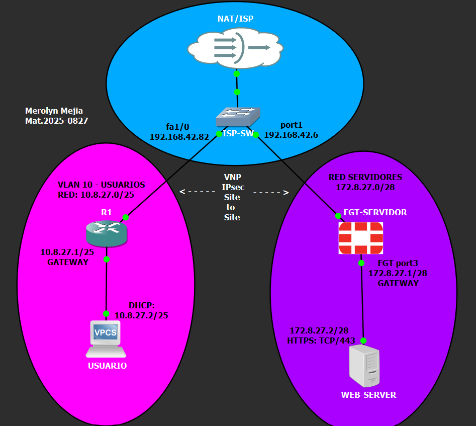

### Direccionamiento utilizado

| Dispositivo | Interfaz | Dirección IP | Función |
|---|---|---|---|
| R1 | FastEthernet0/0 | `10.8.27.1/25` | Gateway Usuarios |
| R1 | FastEthernet1/0 | `192.168.42.82/24` | WAN / ISP |
| Usuario | DHCP | `10.8.27.2/25` | VLAN 10 |
| FortiGate | port1 | `192.168.42.6/24` | WAN / ISP |
| FortiGate | port3 | `172.8.27.1/28` | Gateway Servidores |
| Web Server | ens3 | `172.8.27.2/28` | Servidor HTTPS |

> El segmento `192.168.42.0/24` representa la red WAN/ISP dentro del laboratorio GNS3.
> Para las redes internas se utilizó el identificador `8.27`, basado en los últimos cuatro dígitos de la matrícula `2025-0827`. Por esta razón se utilizaron las redes `10.8.27.0/25` para Usuarios y `172.8.27.0/28` para Servidores.

---

# Configuración de la infraestructura

## Red de Usuarios y DHCP

La red de usuarios corresponde a `10.8.27.0/25` y utiliza `10.8.27.1` como gateway. El direccionamiento de los clientes se entrega mediante DHCP desde R1.

### Dirección obtenida por el Usuario

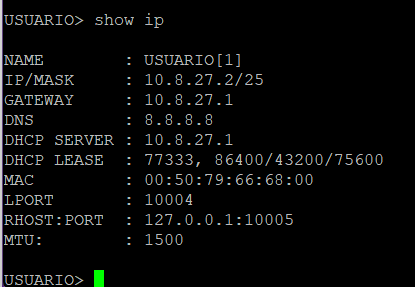

### Pool DHCP en R1

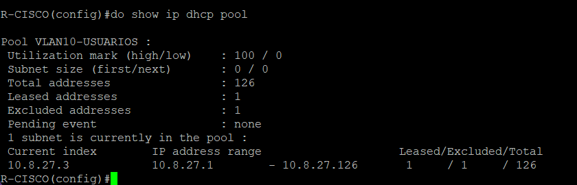

### Interfaces de R1

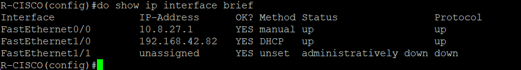

---

## NAT en Cisco

R1 utiliza NAT para proporcionar conectividad externa a la red de usuarios.

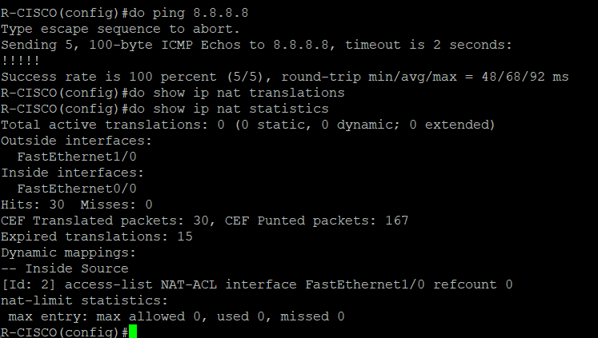

El tráfico entre `10.8.27.0/25` y `172.8.27.0/28` se excluye del proceso NAT para permitir su transporte mediante IPsec.

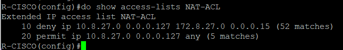

---

## VPN IPsec Site-to-Site

La VPN se estableció entre:

| Parámetro | Cisco | FortiGate |
|---|---|---|
| Peer WAN | `192.168.42.82` | `192.168.42.6` |
| Red protegida | `10.8.27.0/25` | `172.8.27.0/28` |

### Crypto Map de R1

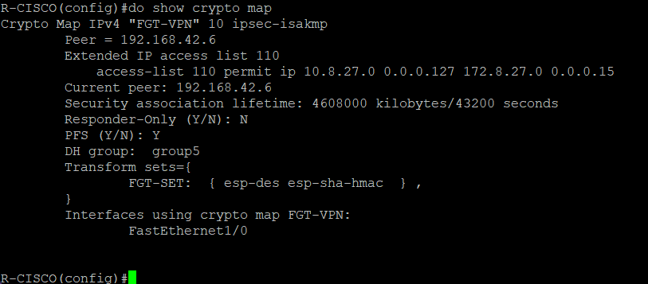

### VPN activa en FortiGate

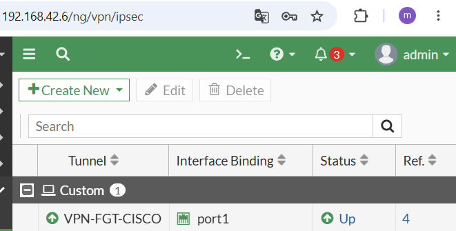

### Estado ISAKMP

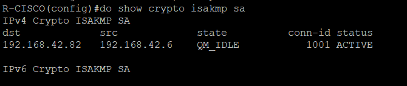

El estado `QM_IDLE / ACTIVE` confirma que la asociación se encuentra establecida.

### Asociación IPsec

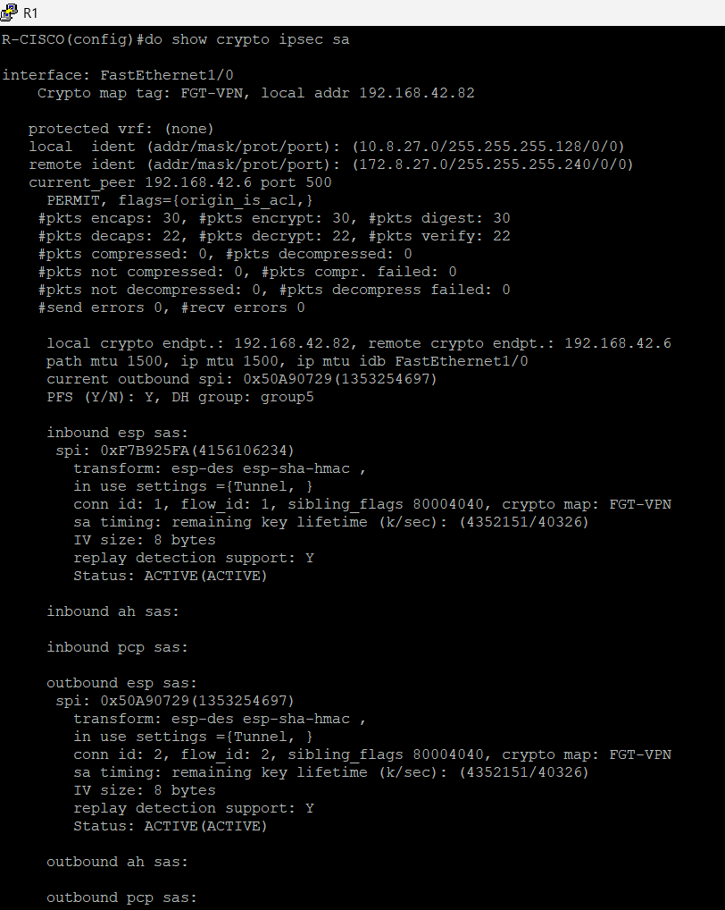

Los contadores de paquetes cifrados y descifrados permiten comprobar que el tráfico está siendo procesado por IPsec.

---

## Web Server HTTPS

El servidor web utiliza la dirección `172.8.27.2/28` y tiene como gateway `172.8.27.1`.

### Configuración de red

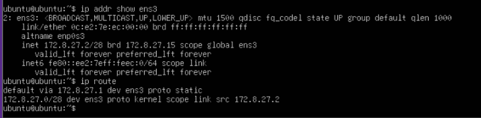

### Servicio HTTPS TCP/443

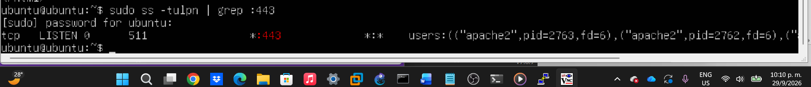

### Respuesta HTTPS

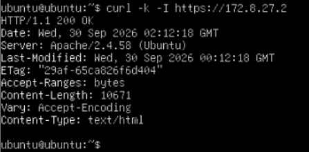

La respuesta `HTTP/1.1 200 OK` confirma el funcionamiento del servicio web mediante HTTPS.

---

## FortiGate

La configuración y demostración del FortiGate se realizó mediante su interfaz gráfica.

### Configuración de interfaces

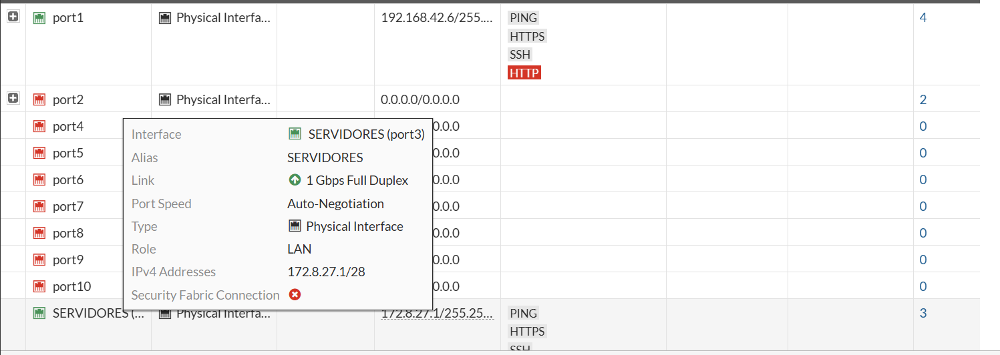

Las interfaces principales son:

- `port1` → `192.168.42.6/24`
- `port3` → `172.8.27.1/28`

### NAT

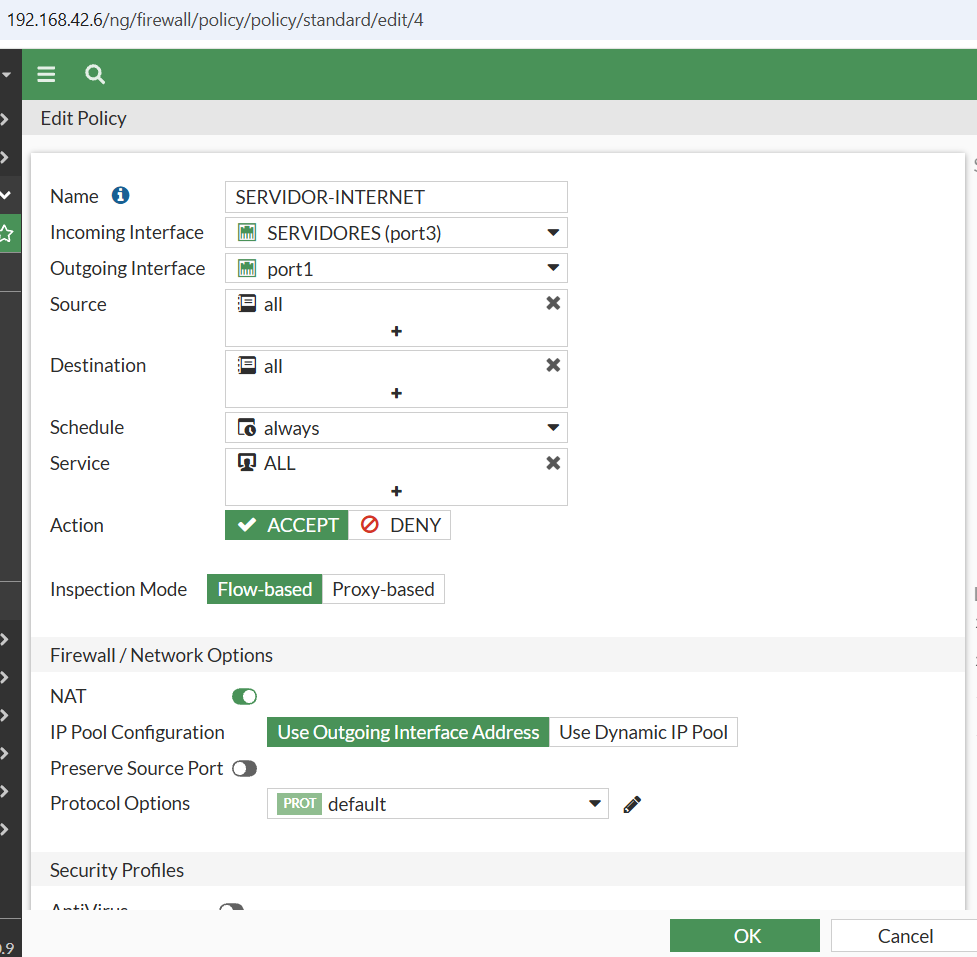

La política `SERVIDOR-INTERNET` permite la salida desde `SERVIDORES (port3)` hacia `port1` utilizando NAT.

---

# Pruebas de funcionamiento

## Conectividad hacia Internet

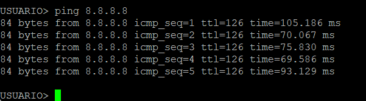

Se verificó conectividad hacia Internet desde la red de usuarios.

---

## Comunicación Usuario → Web Server

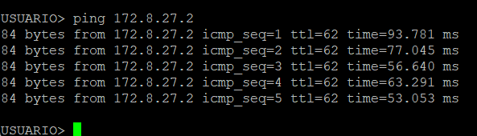

El usuario `10.8.27.2` logra comunicarse con el Web Server `172.8.27.2`.

---

## Traceroute hacia el servidor

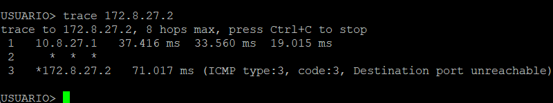

El traceroute permite comprobar el recorrido desde la red de usuarios hasta el servidor remoto.

---

## Prueba con el tráfico VPN bloqueado

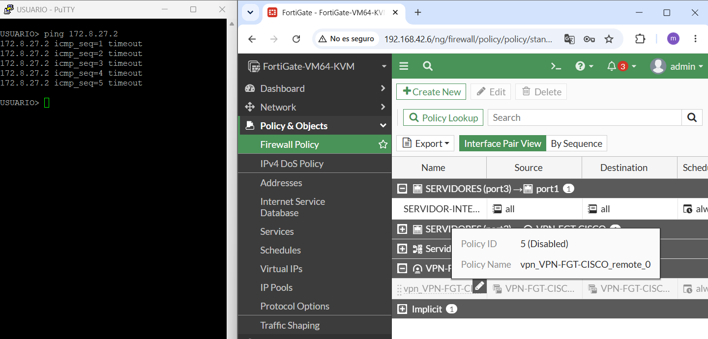

Al deshabilitar desde la GUI del FortiGate la política que permite el tráfico correspondiente a la VPN, el ping hacia `172.8.27.2` presenta `timeout`.

---

## Restauración de la comunicación

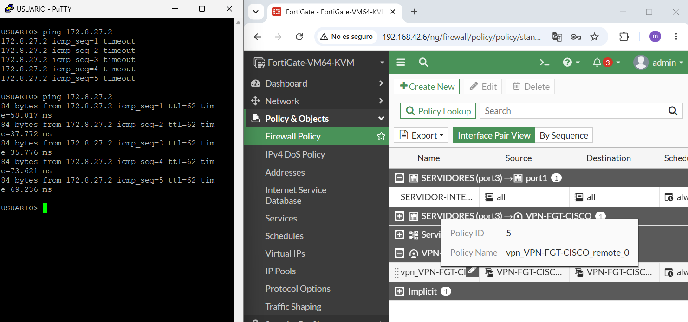

Después de habilitar nuevamente la política, el servidor vuelve a responder.

Esta comparación demuestra que la comunicación entre ambas redes depende del paso del tráfico mediante la VPN configurada.

---

# Running Configuration

La configuración completa del router Cisco R1 se encuentra en:

`Configuraciones/R1-running-config.txt`

Incluye las configuraciones de red, DHCP, NAT y VPN IPsec utilizadas durante la práctica.

---

# Conclusión

En esta práctica se implementó una VPN IPsec Site-to-Site entre un router Cisco y un FortiGate para comunicar la red de usuarios `10.8.27.0/25` con la red de servidores `172.8.27.0/28`.

Las pruebas permitieron comprobar el funcionamiento de DHCP, NAT, HTTPS y del túnel IPsec. También se verificó que, al impedir el paso del tráfico por la VPN, el usuario pierde la comunicación con el servidor y que esta se recupera al restaurar la configuración.

---
